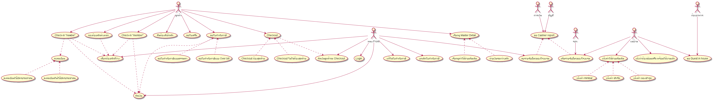
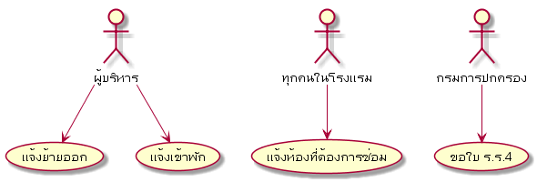
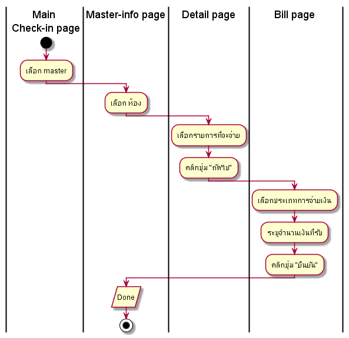
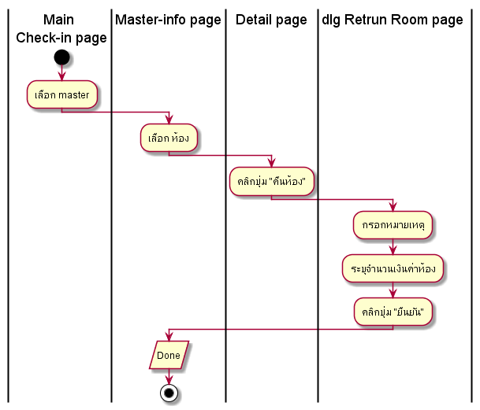
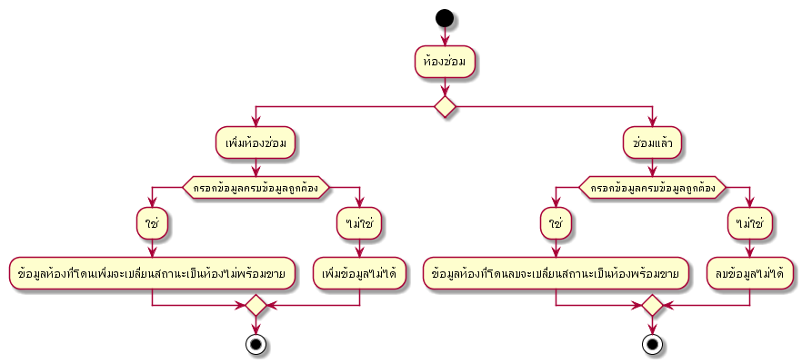
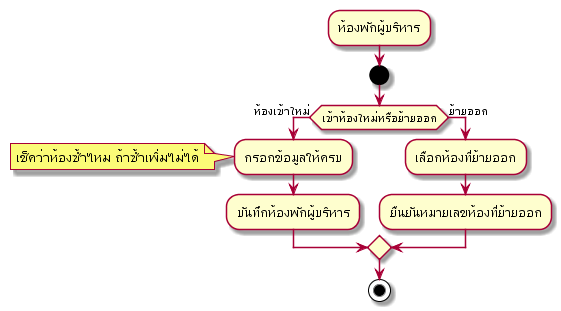
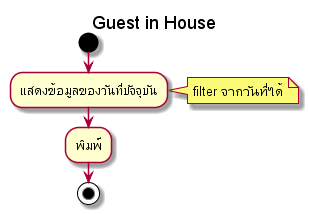
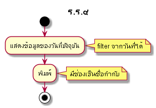
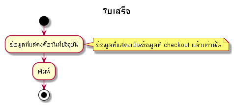
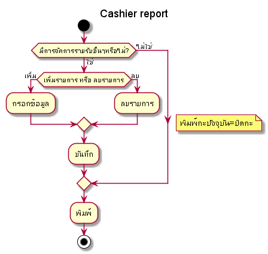

# Prompiman_Diagram

## Usercase Diagram

## Activity Diagram

### Check-in

#### Check-in 

<!-- #### Bill 

#### Return_Room 
 -->
---

### Check-out

#### Check-out 

---

### Extra

#### Extra 

---

### Room

#### Outoforder 

#### Executive 

---

### Management

#### Guest in house 

#### ร.ร.๔ 

#### ใบเสร็จ 

#### Cashier Report 

### Reservation

#### Reservation 

---