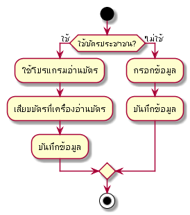
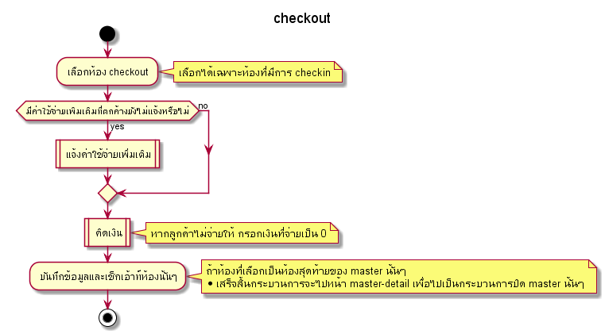
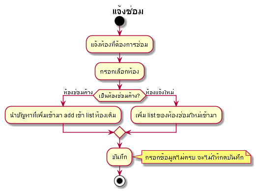
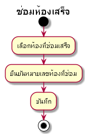
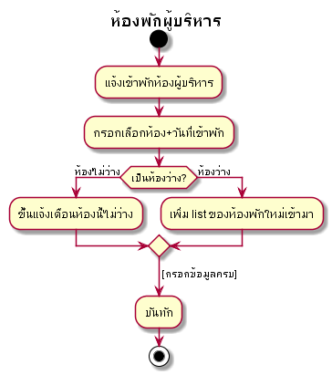
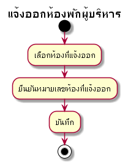
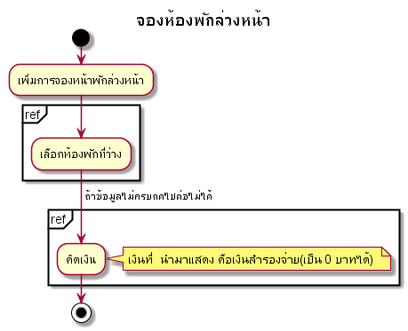
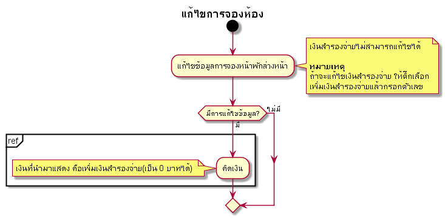
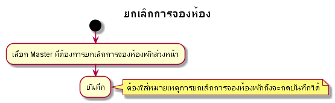
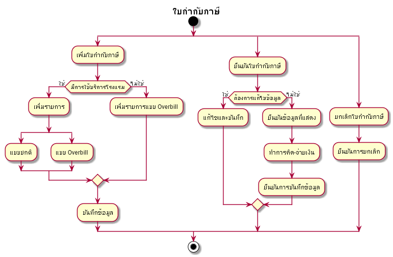

# Prompiman_Diagram

## Usercase Diagram

## Activity Diagram

### Register

#### Register

---
### Check-in

#### Check-in 

<!-- #### Bill 

#### Return_Room 
 -->
---

### Check-out

#### Check-out 

---

### Extra

#### Extra 

---

## ห้องพักไม่พร้อมขาย

### Outoforder 

#### แจ้งซ่อม

#### ซ่อมเสร็จ

### Executive 
#### แจ้งเข้าพัก

#### แจ้งย้ายออก

---

### Reservation

#### เพิ่มจองห้อง 

#### แก้ไขข้อมูลการจอง 

#### ยกเลิกการจอง 

---

### Management

#### Guest in house 

#### ร.ร.๔ 

#### ใบเสร็จ 

#### Cashier Report 

#### Tax Invoice

---
