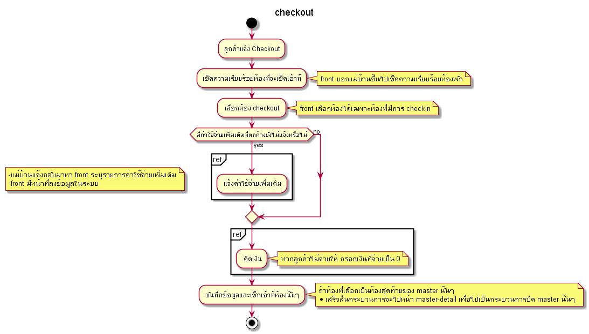

# Prompiman_Diagram

## Usercase Diagram

## Activity Diagram

### Register

.png)

---
### Check-in

.png)

---
### Master

---
### Check-out
 

---
### Return_Room 

.png)

---

### Extra

#### Extra 

---

### Room

#### Outoforder 

#### Executive 

---

### Management

#### Guest in house 

#### ร.ร.๔ 

#### ใบเสร็จ 

#### Cashier Report 

#### ขอใบกำกับภาษี
 

#### แก้ไขใบกำกับภาษี
 

#### ยกเลิกใบกำกับภาษี

---
### Reservation

#### Reservation 

---