# Prompiman_Diagram

## Usercase Diagram

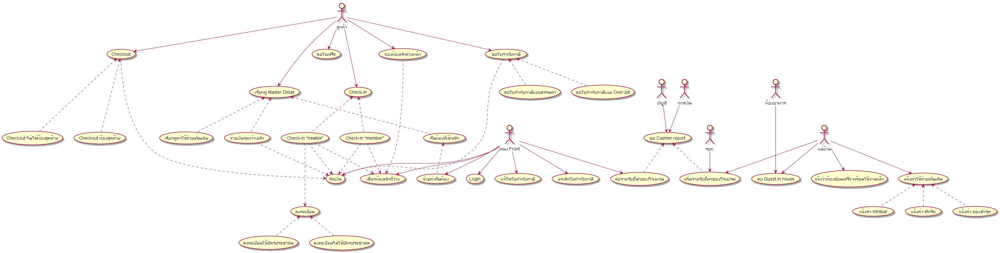

## Activity Diagram

### Register

.png)

---
### Check-in

.png)

---
### เลือกห้องพักที่ว่าง

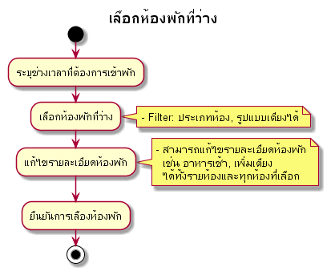

---
### Master

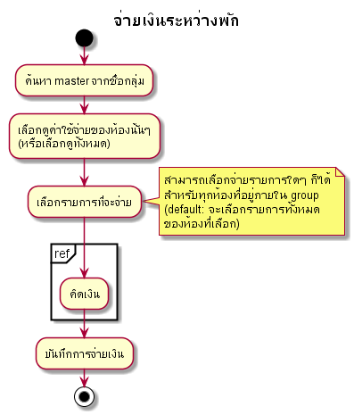

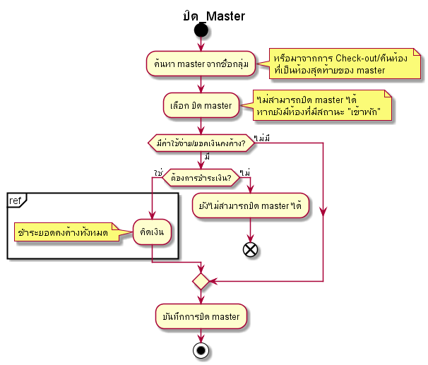

---
### Check-out
 

---
### Return_Room 

.png)

---

### Extra

#### Extra 
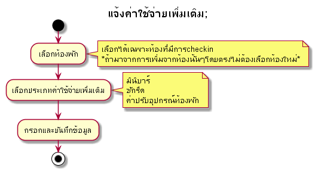

---

## ห้องพักไม่พร้อมขาย

### Outoforder 

#### แจ้งซ่อม
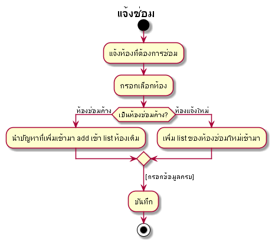

#### ซ่อมเสร็จ

### Executive 
#### แจ้งเข้าพัก

#### แจ้งย้ายออก

---

### Reservation

#### เพิ่มจองห้อง 
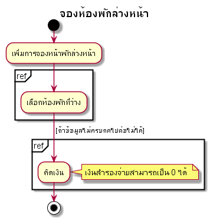

#### แก้ไขข้อมูลการจอง 
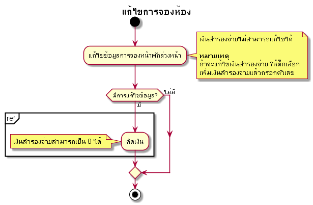

#### ยกเลิกการจอง 
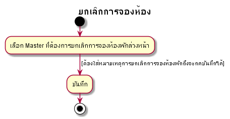
---

### Management

#### Guest in house 

#### ร.ร.๔ 

#### ใบเสร็จ 

#### Cashier Report 

#### ขอใบกำกับภาษี
##### เคสพักรร.
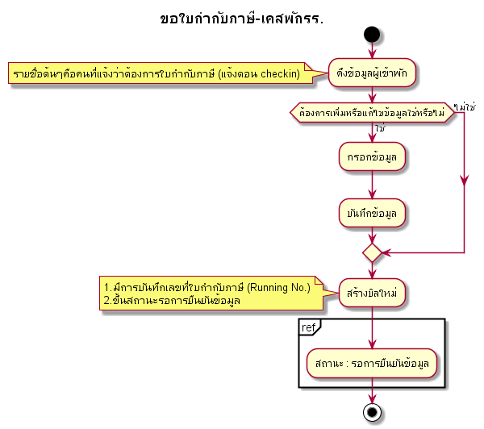 

##### เคสไม่ได้เข้าพักรร.
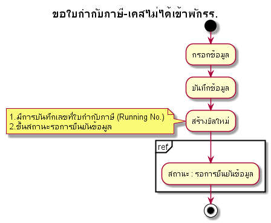 

##### เคสHOLDบิล หรือ สถานะ : รอการยืนยันข้อมูล
.png) 

---
